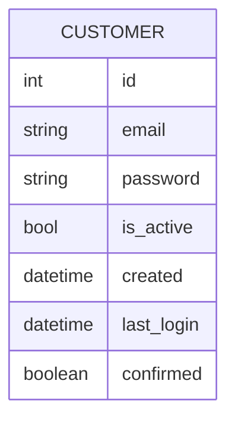
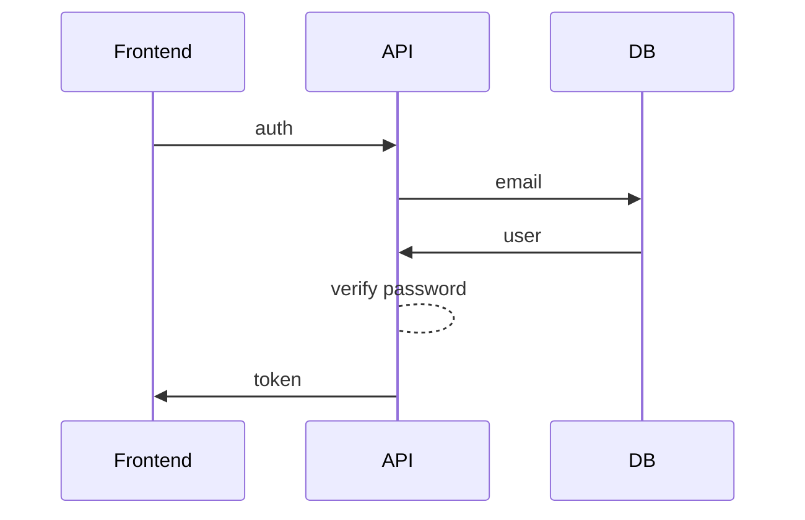
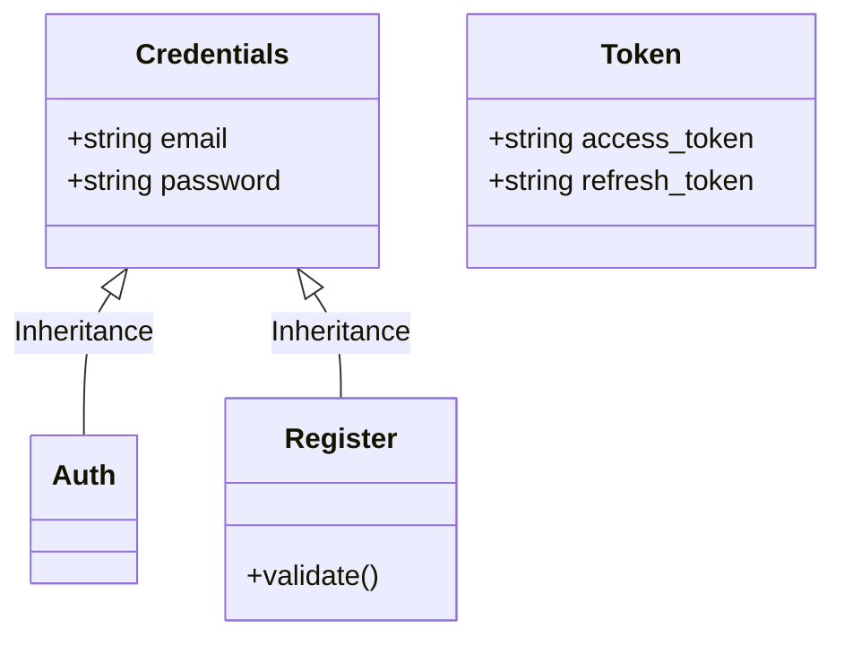
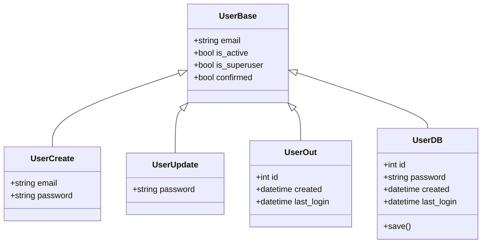

# Development info

## Database

```mermaid
erDiagram
    CUSTOMER {
        int id
        string email
        string password
        bool is_active
        datetime created
        datetime last_login
        boolean confirmed
    }
```

## Sequence Auth

```mermaid
sequenceDiagram
    Frontend->>API: auth
    API->>DB: email
    DB->>API: user
    API-->API: verify password
    API->>Frontend: token
```

### Class Auth

```mermaid
classDiagram
    Credentials <|-- Auth : Inheritance
    Credentials <|-- Register : Inheritance
    class Credentials {
        +string email
        +string password
    }
    Register: +validate()
    class Token {
        +string access_token
        +string refresh_token
    }
    
```

### Class User

```mermaid
classDiagram
    UserBase <|-- UserCreate
    UserBase <|-- UserUpdate
    UserBase <|-- UserOut
    UserBase <|-- UserDB
    class UserBase {
        +string email
        +bool is_active
        +bool is_superuser
        +bool confirmed
    }
    UserCreate: +string email
    UserCreate: +string password
    UserUpdate: +string password
    UserOut: +int id
    UserOut: +datetime created
    UserOut: +datetime last_login
    UserDB: +int id
    UserDB: +string password
    UserDB: +datetime created
    UserDB: +datetime last_login
    UserDB: +save()
```